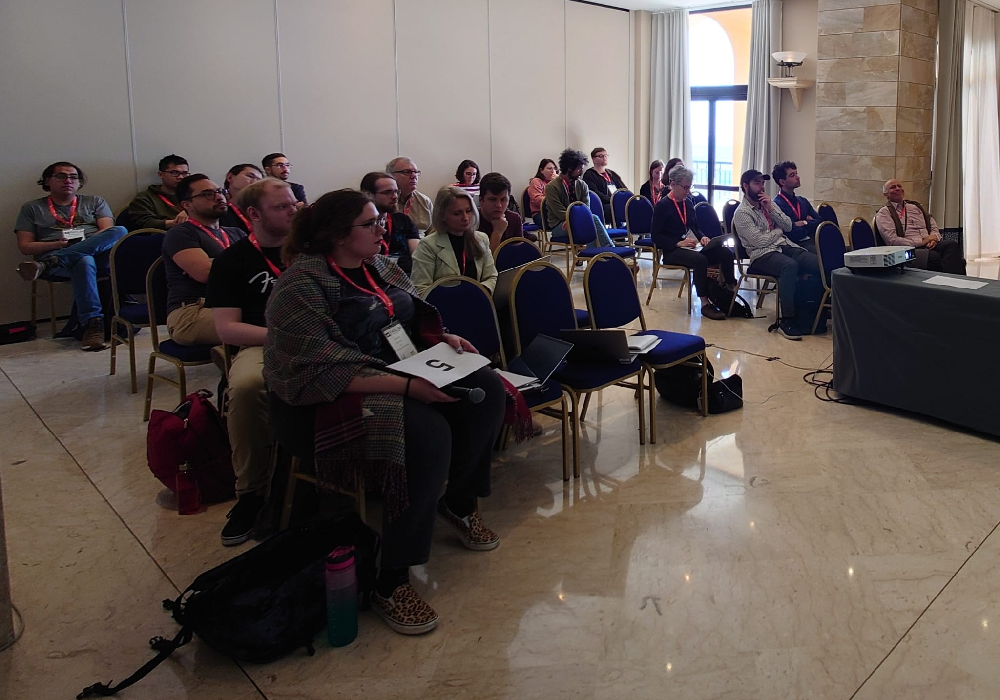

It is 8:45 AM, local time, at Hotel Corinthia in Malta, and we are testing out our Zoom room, setting up the table for the panel discussion, and fighting off the nagging worry as to whether everything will go according to the plan. As more and more presenters and participants trickle in into the room, we take a deep breath and kick off the first [Computational Approaches to Language Data Pseudonymization workshop](https://mormor-karl.github.io/events/CALD-pseudo/). 

Hosted at EACL 2024, the workshop was entirely devoted to pseudonymization (or “student minimization”, as the automatic speech recognition “understood” it), anonymization, data privacy and related concepts. We had received 15 submissions, out of which 10 were accepted for a presentation at the workshop, representing a variety of domains, approaches, and languages. With a respectable audience to witness the presentations, both on site and online, we were happy to see such interest in this topic!

During the workshop we had the opportunity to listen to two invited talks: one by Anders Søgaard and one by Ildikó Pilán. We rounded off the day with a discussion panel featuring Ildikó and Thomas Vakili  — both the talks, the discussion, and all the [wonderful papers](https://aclanthology.org/2024.caldpseudo-1.0/) have certainly left us with some food for thought and ideas for the future (myself, I definitely wrote down a bunch of things to consider in the future and cite in my work in progress…). 

We were also thrilled to see a community emerge in front of our eyes — many of the workshop participants stuck together for the lunch break, and later followed for a wonderful dinner at a traditional Maltese restaurant.

We are definitely looking forward to future opportunities for similar events and are hoping to see many of the participants at other venues, as we are very excited to see what results they will be presenting then!

We are also extending our thanks to all of the organizers and reviewers that have made this workshop possible, as well as to those who have submitted and those who have presented at the workshop, and to our audience — it would not have been possible without you!
